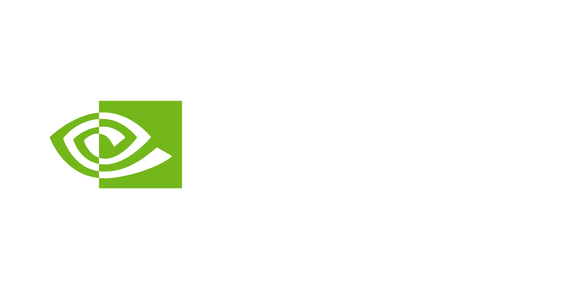

<!-- fg=black bg=green -->
# Containers
>  A lightweight, standalone, executable package of software with everything needed to run an application – code, runtime, system tools, system libraries, and settings.

---
<!-- fg=green bg=black -->
# Intro

---
<!-- fg=green bg=black -->
# Benefits

  - Portable
  - Infrastructure As Code
  - Automated
  - Version Controlled
  - Image Repository
  - Desired State
  - Cross Platform
  
---
<!-- fg=green bg=black -->
# Adoption

  - History
  - Growth / Projections
  
---
<!-- fg=green bg=black -->
# Ecosystem

  - Container Runtimes
  - Image Registries
  - Security
  - CI/CD

---
<!-- fg=green bg=black -->
# Orchestration

  - Kubernetes

---
# Demo

---
<!-- effect=explosions -->

